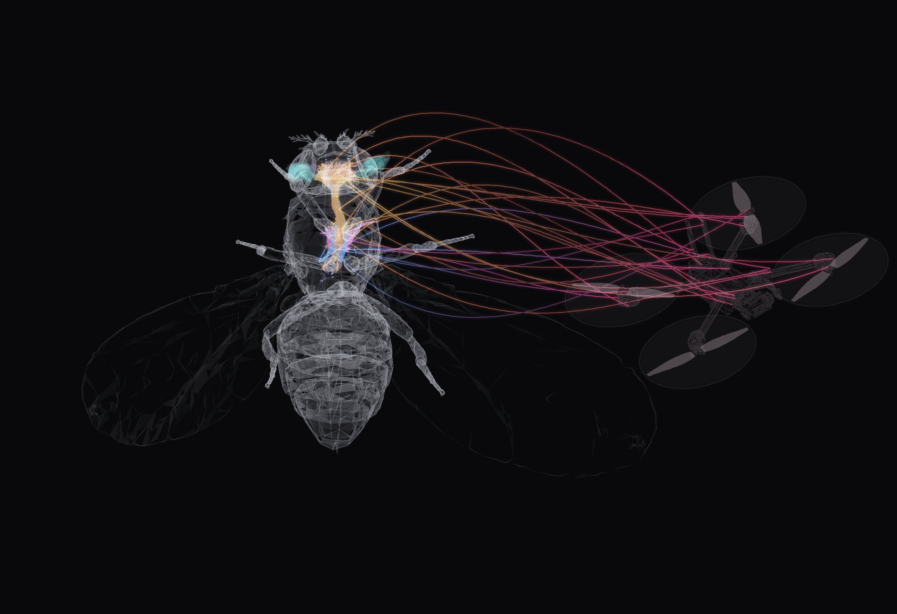
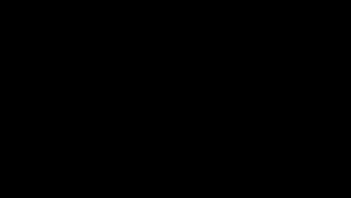
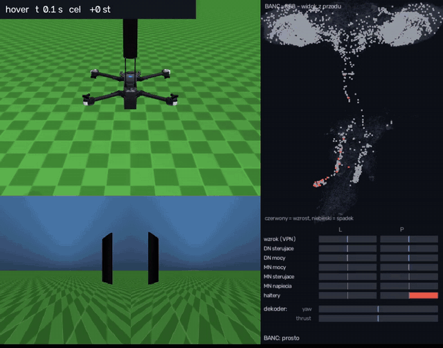
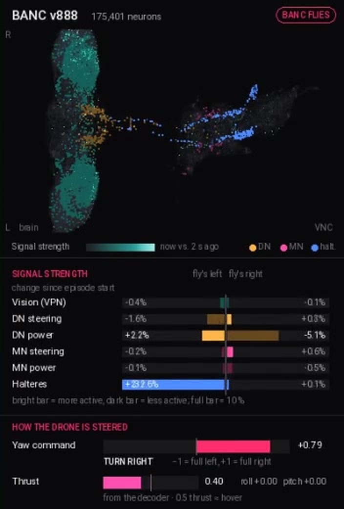
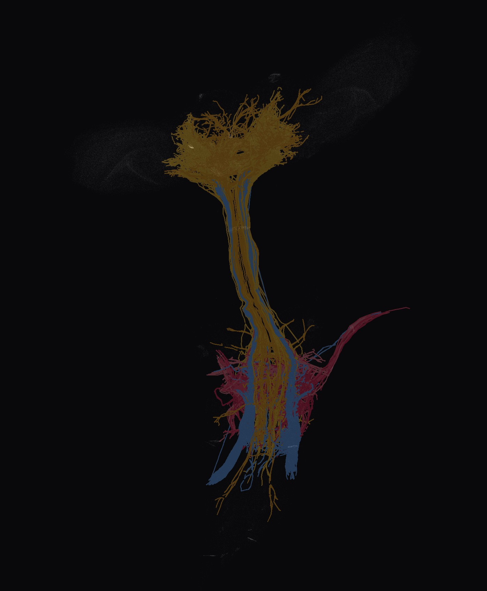
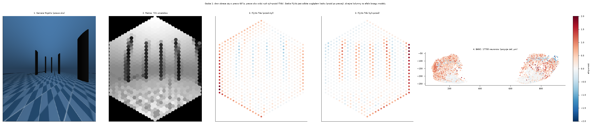
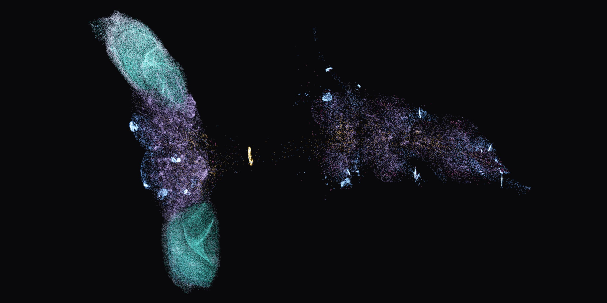
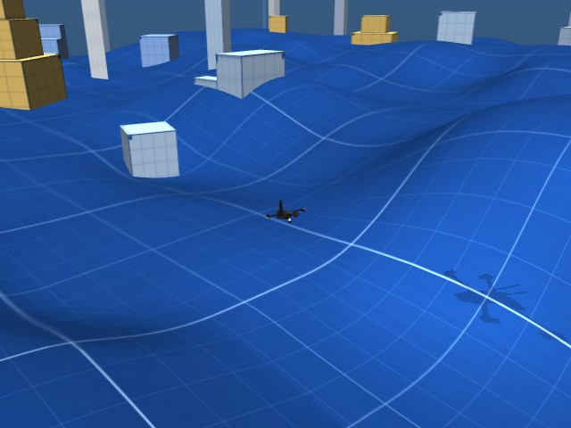
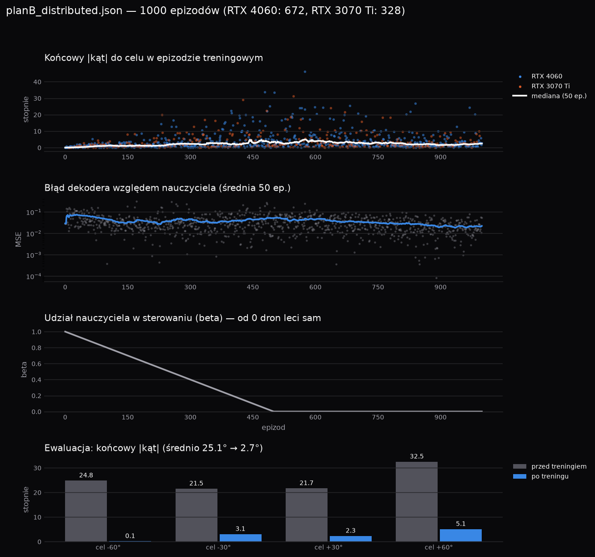

<p align="center">
  <picture>
    <source media="(prefers-color-scheme: dark)" srcset="docs/assets/logo-dark.png">
    
  </picture>
</p>

<p align="center">
  <b>Prawdziwy connectome muszki owocowej steruje dronem.</b><br>
  Kamera → oczy <i>Drosophila</i> (FlyVis) → 175 401 neuronów BANC v888 → motoneurony skrzydeł → quadcopter w MuJoCo → nowy obraz.
</p>

<p align="center">
  <a href="https://github.com/FalconDevX/neurofly/actions/workflows/tests.yml"></a>
  
  
  
  
  <a href="https://doi.org/10.7910/DVN/7WTH1N"></a>
  
  
</p>

<p align="center">
  
  <br><sub>Neurony lotu z BANC v888 (szkielety SWC) w ciele NeuroMechFly i dron Skydio X2. Nitki między nimi są ilustracyjne.</sub>
</p>

## W skrócie

- **Mózg = prawdziwy connectome, nie sieć uczona od zera.** 175 401 neuronów i 1,53 mln połączeń z BANC v888 (mikroskopia elektronowa). Waga połączenia = liczba synaps × znak neuroprzekaźnika. Wewnątrz mózgu nie trenujemy ani jednej wagi.
- **Uczymy tylko odczyt.** Liniowy dekoder czyta 375 neuronów zstępujących lotu (DN) i zamienia je na skręt drona — ok. 380 wag.
- **Kierunek celu jest w neuronach.** Z pojedynczych DN lotu strona celu odczytuje się w 99 % scen (walidacja krzyżowa), zanim cokolwiek wytrenujemy.
- **Pętla zamknięta w czasie rzeczywistym.** Krok całego BANC na GPU laptopa: 2,6 ms na klatkę, kamery 30 FPS.
- **Każdą decyzję da się sprawdzić.** Panel na żywo pokazuje głos każdego neuronu „lewo / prawo”.

---

## Spis treści

- [Demo](#demo)
- [Jak to działa](#jak-to-działa)
- [Wyniki](#wyniki)
- [Szybki start](#szybki-start)
- [Struktura repozytorium](#struktura-repozytorium)
- [Co jest z BANC, a co jest naszym założeniem](#co-jest-z-banc-a-co-jest-naszym-założeniem)
- [Zespół](#zespół)
- [Źródła i podziękowania](#źródła-i-podziękowania)

## Demo

<p align="center">
  
  <br><sub>Od muszki do connectomu: skala (ziarno maku ~1 mm), zbliżenie na głowę, potem widok z góry i części układu nerwowego BANC v888 podświetlane od głowy w dół, na końcu dron połączony z obwodem lotu (nitki ilustracyjne). Pełna wersja 1080p: <code>docs/prezentacja/render_tour.py</code>.</sub>
</p>

<p align="center">
  
  <br><sub>Scenariusz <code>turn_right</code>: cel 60° w prawo. Na górze dron, na dole widok z jego dwóch oczu, z prawej aktywność BANC na żywo i komenda dekodera.</sub>
</p>

<table>
  <tr>
    <td width="50%"></td>
    <td width="50%"></td>
  </tr>
  <tr>
    <td><sub><b>Panel BANC na żywo</b> (<code>sim/brain_panel.py</code>): somy mózgu i VNC, siła sygnału wzrok → DN → MN → haltery po lewej i prawej stronie, komenda yaw / thrust.</sub></td>
    <td><sub><b>Obwód lotu z BANC:</b> neurony zstępujące lotu (DN), szyja, motoneurony skrzydeł i aferenty halter, do których trafia żyroskop drona.</sub></td>
  </tr>
</table>

## Jak to działa

<p align="center">
  
  <br><sub>Ścieżka wzroku: kamera MuJoCo → retina 721 ommatidiów → FlyVis (np. T4a/T4b, detektory ruchu) → aktywność neuronów BANC w ich prawdziwych pozycjach.</sub>
</p>

```
 ┌──────────────┐   RGB L/P   ┌──────────────────┐  aktywność   ┌───────────────────────┐
 │ MuJoCo, X2   │ ──────────▶ │ FlyGym Retina     │ ───────────▶ │ BANC v888              │
 │ 2 kamery,    │             │ + FlyVis          │  typów       │ 175 401 neuronów       │
 │ IMU, świat   │             │ (visual_pipeline) │  komórek     │ 1,53 mln połączeń      │
 └──────▲───────┘             └──────────────────┘              │ model szybkości na GPU │
        │                                                        └──────────┬────────────┘
        │  thrust / roll / pitch / yaw          ┌──────────────────┐        │ DN lotu, MN skrzydeł
        └────────────────────────────────────── │ dekoder (Plan B)  │ ◀──────┘
                                                └──────────────────┘   żyroskop → haltery ──▲
```

1. **Oczy.** Dwie kamery na nosie drona renderują obraz, FlyGym zamienia go na wejście 721 ommatidiów, a wytrenowany FlyVis liczy odpowiedzi typów komórek płata wzrokowego.
2. **Mapowanie na BANC.** Każdy typ FlyVis jest przypisany do neuronów BANC v888 tego samego typu (`visual_pipeline/flyvis_banc_map.csv`, 0 niedopasowanych ID).
3. **Connectome.** Pełny graf v888 (krawędzie ≥ 5 synaps, znak z przewidywanego neuroprzekaźnika) liczony jako model szybkości na GPU: ~2,6 ms na klatkę na RTX 4060 Laptop.
4. **Czujniki.** Żyroskop drona pobudza aferenty halter L/P, tak jak u muszki.
5. **Odczyt.** Kierunek (yaw) dekodowany z pojedynczych neuronów zstępujących lotu (375 DN), moc i stabilizacja z motoneuronów skrzydeł i czujników drona.
6. **Lot.** Mixer zamienia komendę na obroty czterech silników X2 i pętla się zamyka.

<table>
  <tr>
    <td width="50%"></td>
    <td width="50%"></td>
  </tr>
  <tr>
    <td><sub><b>Eksplorator BANC 3D</b> (<code>explorer/</code>, Next.js + three.js): wszystkie somy v888 z oficjalnych pozycji, kolor wg <code>super_class</code>.</sub></td>
    <td><sub><b>WorldEnv:</b> losowy teren, bloki i maszt celu; dron leci do celu i (w toku) omija przeszkody.</sub></td>
  </tr>
</table>

## Wyniki

Wszystkie liczby z pełnego BANC v888, prawdziwego FlyVis i fizyki MuJoCo.

| Pomiar | Wynik |
|---|---|
| Trafność strony celu z aktywności **pojedynczych DN lotu** | **99 %** (korelacja kąta 0,88) |
| To samo z 6 średnich grup motoneuronów | 68 % |
| Skręt do celu ±30°/±60°, końcowy błąd kursu (1000 epizodów na 2 GPU) | **25,1° → 2,7°** |
| Podmuch: maks. odchylenie → powrót | 35° → 1,5° po 3,9 s |
| Zawis (`--thrust hold`) | błąd < 2° |
| Lot do celu w nowych losowych światach, nauczyciel wyłączony (czysty korytarz) | 138 / 150 |
| Czas kroku BANC (RTX 4060 Laptop / CPU) | 2,6 ms / 24 ms na klatkę |

<p align="center">
  
  <br><sub>Trening rozproszony (RTX 4060 + RTX 3070 Ti, <code>scripts/train_distributed.py</code>): udział nauczyciela maleje do 0, dron leci sam; na dole ewaluacja przed i po treningu.</sub>
</p>

**Czego (jeszcze) nie umiemy** — mówimy o tym wprost:

- ciąg z samego BANC jest za słaby do utrzymania wysokości (thrust 0,3–0,46), w demo wysokość trzyma regulator lub czujniki,
- lewy płat wzrokowy w v888 ma dużo mniej neuronów z nadanym `cell_type`, więc lewe oko zasila ~3× mniej neuronów niż prawe,
- dron nie omija jeszcze przeszkód sam z siebie: nauczyciel z promieni MuJoCo omija bloki w 43 z 44 światów, a uczenie BANC na tych lotach (`--obstacles path`) jest w toku,
- to symulacja — na prawdziwym dronie jeszcze nie lataliśmy.

## Szybki start

```bash
# 1. Środowisko (Python 3.12; torch z CUDA przed resztą, inaczej BANC liczy się na CPU)
pip install torch --index-url https://download.pytorch.org/whl/cu126
pip install -e .[all]                     # extras: vision, sim, dev

# 2. Dane
python scripts/download_banc.py           # BANC v888 → data/banc_888/ (~360 MB, publiczny bucket)
python scripts/fetch_menagerie.py         # model Skydio X2 → third_party/
flyvis download-pretrained                # wagi FlyVis

# 3. Sprawdzenie instalacji i testy
python scripts/doctor.py
pytest

# 4. Lot: wzrok → BANC → dron w jednym procesie, z panelem BANC i wideo
python scripts/fly_banc.py --local --brain --decoder data/decoders/planB_dn.npz --video data/videos/demo.mp4
```

Inne punkty wejścia:

| Polecenie | Co robi |
|---|---|
| `python -m sim.viewer [--brain]` | dron z klawiatury (WASD/Shift/Ctrl/Q/E), opcjonalnie BANC obserwuje |
| `python -m sim.run_env --banc <wagi>` | okno 3D: lot do celu w losowym świecie sterowany BANC |
| `python scripts/train_world.py` | trening dekodera (DAgger) w świecie |
| `python scripts/train_distributed.py --world` | to samo na kilku GPU w LAN (master + workerzy ZMQ) |
| `python scripts/vision_server.py` | serwer wzroku/BANC przez ZMQ dla zewnętrznego symulatora |
| `python scripts/plot_training.py <plik.json>` | wykresy z treningu |
| `cd explorer && npm install && npm run dev` | eksplorator BANC 3D, szczegóły w [explorer/README.md](explorer/README.md) |

## Struktura repozytorium

```
banc_control/      connectome v888, dynamika (GPU/CPU), grupy lotu, dekodery, kalibracje
visual_pipeline/   FlyGym Retina + FlyVis → neurony BANC, oczy MuJoCo, protokół ZMQ, serwer
sim/               DroneEnv / WorldEnv w MuJoCo, mixer, pilot BANC, panel mózgu, okna podglądu
scripts/           pobieranie danych, trening, lot, diagnostyka, eksport wizualizacji
explorer/          eksplorator connectomu (Next.js 16, @react-three/fiber)
tests/             pytest (testy wymagające GPU / FlyVis / danych BANC same się pomijają)
docs/              plany osób, prezentacja, grafiki
```

## Co jest z BANC, a co jest naszym założeniem

**Z BANC v888:** neurony, połączenia, liczby synaps, przewidywane neuroprzekaźniki, przynależność do grup (`super_class`, `super_cluster`, `cell_function`, `body_part_sensory`), pozycje som i szkielety. Nie używamy żadnych syntetycznych grafów ani zgadywanych typów komórek.

**Nasze założenia:** model dynamiki (szybkości, τ = 20 ms, dt = 5 ms, gain 0,9), znaki neuroprzekaźników (ACh +, GABA / glutaminian / histamina −), kodowanie żyroskopu na aferenty halter, liniowy dekoder z DN lotu uczony z nauczycielem oraz podział ról: BANC daje percepcję i kierunek, czujniki drona stabilizację. Szczegóły w [CLAUDE.md](CLAUDE.md) i planach w `docs/`.

## Zespół

Team **the Roook**:

| Rola | Kto | Zakres | Plan |
|---|---|---|---|
| Oczy | Dawid Wypych | kamera RGB → FlyGym Retina → FlyVis → neurony BANC | [docs/osoba1-plan.md](docs/osoba1-plan.md) |
| Mózg | Mateusz Nowaczek | BANC na GPU, dekodery, trening rozproszony | [docs/osoba2-plan.md](docs/osoba2-plan.md) |
| Ciało | Krzysztof Mazur | dron X2 w MuJoCo, światy 3D, czujniki | [docs/osoba3-plan.md](docs/osoba3-plan.md) |

## Źródła i podziękowania

- **BANC** (Brain And Nerve Cord connectome), Bates et al. 2026 — dane v888 z publicznego bucketu Lee Lab, mirror: [doi:10.7910/DVN/7WTH1N](https://doi.org/10.7910/DVN/7WTH1N)
- **FlyVis** — Lappalainen et al., connectome-constrained model płata wzrokowego
- **FlyGym / NeuroMechFly** — model retiny i siatka ciała muszki
- **MuJoCo** i **MuJoCo Menagerie** — fizyka i model Skydio X2
