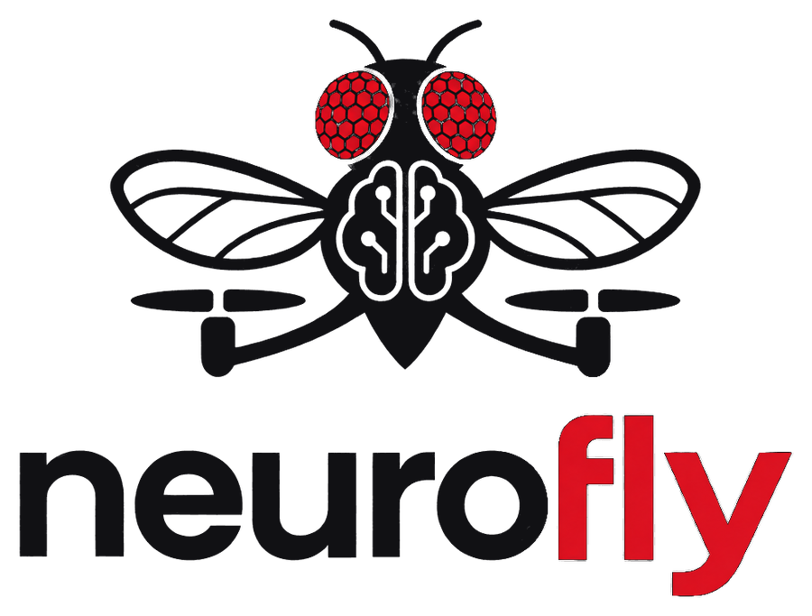

<p align="center">
  <picture>
    <source media="(prefers-color-scheme: dark)" srcset="docs/assets/logo-dark.png">
    
  </picture>
</p>

# NeuroFly

Hackathon: zamknięta pętla wzrok → connectome Drosophila → sterowanie → symulowany dron → nowy obraz.

| Osoba | Zakres |
|---|---|
| 1 | Kamera RGB → FlyGym Retina → RetinaMapper → FlyVis → neurony BANC |
| 2 | BANC/VNC → motoneurony skrzydeł → thrust / roll / pitch / yaw (`banc_control/`) |
| 3 | MuJoCo, quadcopter, 2 kamery, IMU, epizody treningowe |

## Start

```bash
pip install -r requirements.txt          # banc_control + MuJoCo (domyślnie)
python scripts/fetch_menagerie.py        # model drona Skydio X2 → third_party/
python -m sim.viewer                     # dron Osoby 3: łopaty, regulator, WASD/Shift/Ctrl/Q/E
python scripts/download_banc.py          # dane BANC v888 → data/
```

GPU dla symulacji BANC: `pip install torch --index-url https://download.pytorch.org/whl/cu126` (bez tego liczy na CPU).

## Plany

- Plan Osoby 1: [docs/osoba1-plan.md](docs/osoba1-plan.md) (`visual_pipeline/`, Python 3.12, `pip install -e .[vision]`)
- Plan Osoby 2: [docs/osoba2-plan.md](docs/osoba2-plan.md)
- Plan Osoby 3: [docs/osoba3-plan.md](docs/osoba3-plan.md) (symulator MuJoCo, `conda env create -f environment.yml`)
- Testy: `pip install -e .[dev] && pytest`
